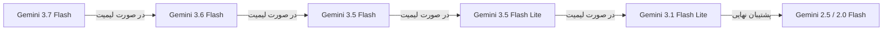

<div align="center">

# 🤖 ربات تلگرام فوق‌پیشرفته «فرامرز» (Faramarz AI Bot)

**دستیار هوشمند تمام‌عیار، صمیمی و نسل جدید تلگرام بر بستر Serverless Edge و هوش مصنوعی Google Gemini**

[](https://workers.cloudflare.com/)
[](https://aistudio.google.com/)
[](https://core.telegram.org/bots/api)
[](https://developer.mozilla.org/)
[](LICENSE)

<br/>

[🌟 قابلیت‌ها](#-ویژگی‌ها-و-قابلیت‌های-منحصربه‌فرد) •
[⛓️ زنجیره مدل‌ها](#-زنجیره-اولویت-مدل‌های-هوش-مصنوعی) •
[🚀 راهنمای راه‌اندازی](#-راهنمای-راه‌اندازی-و-استقرار-در-۱-دقیقه) •
[📖 لیست دستورات](#-لیست-دستورات-ربات) •
[🛠 معماری فنی](#-معماری-سیستم)

</div>

---

## 🌟 ویژگی‌ها و قابلیت‌های منحصربه‌فرد

### 💬 چت طبیعی و صمیمی (Iranian Persona)
- صحبت به زبان کاملاً خودمانی، باهوش، محترمانه و رفاقتی
- بدون خروجی‌های خشک یا ماشینی؛ درک عمیق اصطلاحات فارسی و شوخ‌طبعی سالم

### ⚡ سرعت پاسخ‌دهی زیر ۲ ثانیه (Zero-Friction Chat)
- پردازش ابری در شبکه لبه (Edge) کلودفلر در بیش از ۳۰۰ دیتاسنتر جهان
- مکالمات روزمره بدون هیچ‌گونه تاخیر یا سربار ابزارهای سنگین اجرا می‌شوند

### 🚀 سیستم جستجو و تحقیق ۲ لایه‌ای (Perplexity-Style UX)
- **پاسخ فوری به سوال:** فرامرز بلافاصله پاسخ اولیه را به همراه لینک منابع وب ارسال می‌کند.
- **دکمه تعاملی تحقیق عمیق:** زیر هر پاسخ، یک دکمه شیشه‌ای شیک قرار دارد:
  `[ 🚀 تولید تحقیق عمیق و گزارش جامع درباره این موضوع ]`
  کاربر تنها با ۱ کلیک می‌تواند بدون تایپ مجدد، مقاله و تحقیقی کامل با سرفصل‌ها و جدول مقایسه‌ای از **Gemini Pro** دریافت کند.

### 🖼 بینایی ماشین و تحلیل تصویر (Vision AI)
- پردازش، خواندن متن (OCR)، ترجمه و تحلیل موشکافانه انواع تصاویر و اسکرین‌شات‌ها
- تبدیل باینری فوق‌سریع با بافر در حافظه رم بدون افت کیفیت

### 📊 قیمت‌های زنده بازار و کریپتو (Live Info Engine)
- استخراج لحظه‌ای قیمت **دلار آزاد، طلای ۱۸ عیار، سکه امامی و بهار آزادی** از TGJU
- دریافت آنلاین نرخ لحظه‌ای ارزهای دیجیتال (**بیت‌کوین، اتریوم، تتر و...**) از CoinGecko به تومان

### 📋 سیستم لاگ اختصاصی در پیوی مالک (Live PV Logger)
- ارسال لحظه‌ای تمام رویدادها، نام و آیدی کاربر فرستنده، نام گروه، زمان پردازش به میلی‌ثانیه و وضعیت مدل‌ها به پیوی مالک ربات (`@Bxiqm`)
- گزارش و خطایابی خودکار و شفاف در لحظه

### 💾 حافظه شخصی ۳۰ روزه (Long-Term Memory)
- ذخیره پایدار فکت‌های هویتی، علاقه‌مندی‌ها و اطلاعات کاربر در دیتابیس Cloudflare KV

---

## ⛓️ زنجیره اولویت مدل‌های هوش مصنوعی

ربات به یک موتور **سوییچ خودکار در هنگام لیمیت (Failover Engine)** مجهز است که در صورت پر شدن ظرفیت (Rate-limit 429) یا بروز خطا، در میلی‌ثانیه به مدل بعدی منتقل می‌شود:



### 🔬 مدل‌های اختصاصی تحقیق عمیق (Deep Research):
- `gemini-2.5-pro` (موتور تحلیلی پرچمدار با سرچ زنده گوگل و سرفصل‌بندی علمی)
- `gemini-2.0-flash` (پشتیبان سرچ)

---

## 🛠 معماری سیستم

```
                      ┌────────────────────────────────────────┐
                      │             Telegram User              │
                      └───────────────────┬────────────────────┘
                                          │ Webhook POST
                                          ▼
                      ┌────────────────────────────────────────┐
                      │    Cloudflare Workers (Edge Node)      │
                      │ ────────────────────────────────────── │
                      │  • Router & Safe Telegram Messenger    │
                      │  • SmartChat (Context & Identity)      │
                      │  • Vision Binary Buffer Handler        │
                      │  • Live PV Logger (Owner Real-time)    │
                      └───────┬───────────────┬────────────────┘
                              │               │
            ┌─────────────────┴─┐           ┌─┴────────────────┐
            ▼                   ▼           ▼                  ▼
     ┌─────────────┐     ┌─────────────┐  ┌─────────────┐ ┌─────────────┐
     │ Cloudflare  │     │   Google    │  │    TGJU     │ │  CoinGecko  │
     │ KV Storage  │     │ Gemini API  │  │ Market Data │ │ Crypto API  │
     └─────────────┘     └─────────────┘  └─────────────┘ └─────────────┘
```

---

## 🚀 راهنمای راه‌اندازی و استقرار در ۱ دقیقه

### گام اول: کلون کردن ریپازیتوری
```bash
git clone https://github.com/imTruck/faramarz-bot.git
cd faramarz-bot
npm install
```

### گام دوم: ساخت دیتابیس KV در Cloudflare
وارد داشبورد [Cloudflare](https://dash.cloudflare.com/) شوید یا با ترمینال بسازید:
```bash
npx wrangler kv:namespace create "KV_STORAGE"
```

### گام سوم: اتصال ریپازیتوری به Cloudflare Workers
1. در پنل Cloudflare به بخش **Workers & Pages $\rightarrow$ Create $\rightarrow$ Connect to Git** بروید.
2. مخزن `faramarz-bot` را انتخاب کرده و مستقر کنید.

### گام چهارم: تنظیم متغیرها (Variables and Secrets)
در تب **Settings $\rightarrow$ Variables and Secrets** دو متغیر زیر را اضافه کنید:
- `BOT_TOKEN`: توکن ربات تلگرام دریافتی از [@BotFather](https://t.me/BotFather)
- `GEMINI_API_KEY`: کلید API گوگل از [Google AI Studio](https://aistudio.google.com/)

### گام پنجم: اتصال KV Binding
در تب **Settings $\rightarrow$ Bindings**:
- روی **Add $\rightarrow$ KV Namespace** بزنید.
- نام متغیر (**Variable name**): بنویسید `KV_STORAGE`
- دیتابیس خود را انتخاب کرده و دکمه **Save and Deploy** را بزنید.

### گام ششم: ست کردن وبهوک تلگرام
آدرس زیر را در مرورگر باز کنید (توکن و ساب‌دامین خود را قرار دهید):
```text
https://api.telegram.org/bot<BOT_TOKEN>/setWebhook?url=https://<YOUR_WORKER_SUBDOMAIN>.workers.dev/
```

---

## 📖 لیست دستورات ربات

| دستور | عملکرد |
| :--- | :--- |
| `/start` | شروع کار با ربات، معرفی قابلیت‌ها و بارگذاری کیبورد اصلی |
| `/price` | استخراج لحظه‌ای نرخ دلار، طلای ۱۸ عیار، سکه و ارزهای دیجیتال |
| `/scan` | اسکن و همگام‌سازی زنده مدل‌های فعال و رایگان Google AI Studio |
| `/models` | نمایش مدل فعال و لیست تمام مدل‌های متصل |
| `/memory` | مشاهده اطلاعات و فکت‌های ذخیره شده در حافظه فرامرز |
| `/remind <متن>` | افزودن دستی یک نکته یا یادآوری به حافظه ربات |
| `/forget` | پاکسازی کامل تاریخچه و حافظه اختصاصی کاربر |
| `/clear` | پاک کردن تاریخچه مکالمه در چت فعلی |
| `/status` | گزارش وضعیت اتصال سرور، وب‌هوک و سلامت کلیدها |
| `/admin` | ورود به پنل مدیریت پیشرفته تلگرام (مخصوص مالک ربات) |

---

## 📁 ساختار پوشه‌ها و فایل‌های پروژه

```text
faramarz-bot/
├── src/
│   ├── index.js          # نقطه ورود ورکر، هندلر وب‌هوک تلگرام و پنل لاگ زنده
│   ├── config.js         # تنظیمات مرکزی، پرامپت هویتی و اولویت مدل‌ها
│   ├── smart-chat.js     # هسته چت هوشمند، مسیریاب معنایی و گزارش عمیق
│   ├── api.js            # برقراری ارتباط با Gemini API و سیستم Failover
│   ├── api-scanner.js    # اسکنر زنده مدل‌های رایگان Google AI Studio
│   ├── commands.js       # مدیریت دستورات تلگرام و کیبوردهای تعاملی
│   ├── image.js          # پردازش باینری عکس، OCR و ری‌اکشن استیکرها
│   ├── live-info.js      # ماژول قیمت‌های لحظه‌ای بازار ایران و کریپتو
│   ├── memory.js         # مدیریت حافظه ۳۰ روزه و فکت‌های هویتی
│   ├── storage.js        # لایه دسترسی امن به Cloudflare KV Storage
│   ├── group.js          # فیلتر هوشمند پیام‌ها و القاب گروهی
│   ├── telegram-admin.js # پنل ادمین اینلاین درون چت تلگرام
│   ├── admin-html.js     # داشبورد تحت وب راه‌اندازی و دیباگ
│   ├── search.js         # موتور پشتیبان سرچ وب
│   └── browser.js        # ماژول تمیزکننده متون وب‌سایت‌ها
├── wrangler.toml         # کانفیگ رسمی Cloudflare Wrangler
├── package.json          # مشخصات پروژه و اسکریپت‌ها
└── README.md             # مستندات کامل پروژه
```

---

## 👨‍💻 سازنده و پشتیبانی

- **نام ربات:** فرامرز (Faramarz Bot)
- **شناسه ربات در تلگرام:** [@faramarz_edited_bot](https://t.me/faramarz_edited_bot)
- **مالک و توسعه‌دهنده:** [@Bxiqm](https://t.me/Bxiqm) (User ID: `6695218234`)
- **مخزن گیت‌هاب:** [imTruck/faramarz-bot](https://github.com/imTruck/faramarz-bot)

---

<div align="center">
ساخته شده با ❤️ برای جامعه فارسی‌زبان و علاقه‌مندان به هوش مصنوعی
</div>
